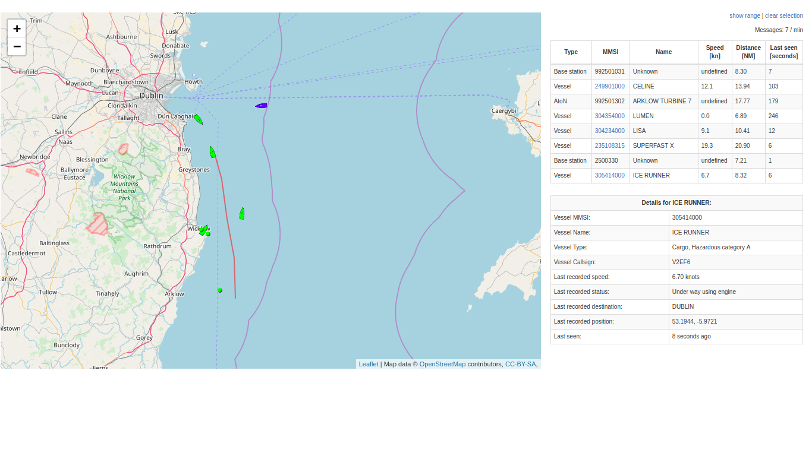

# AISView
AISView is an attempt to create web UI for AIS receiver, similar to the one built into dump1090 (for those familiar with ADS-B receiving).

## Dependencies (not included in this repository)
This software implements small UDP server that listens on chosen port for raw NMEA messages (AIVDM). [libais](https://github.com/schwehr/libais) is therefore needed to decode messages and provide data in JSON format to web frontend.

## Dependencies (included here or used from CDN)
* [Leaflet](http://leafletjs.com/)
> an open-source JavaScript library for mobile-friendly interactive maps.
* [Openstreetmap](https://www.openstreetmap.org/)
> OpenStreetMap is a map of the world, created by people like you and free to use under an open licence.
* [Leaflet.RotatedMarker](https://github.com/bbecquet/Leaflet.RotatedMarker)
> Leaflet plugin to enable the rotation of map marker icons.

## Screenshot (as of 2017/01/12)

